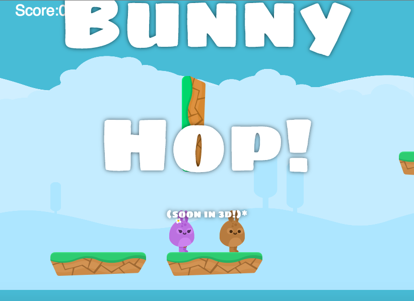

# Bunny Hop

A 24 hours project, where I learned how to become a MASTER CODER thanks to bunny GOD(@pedsm) which used the powers of JS and P5.js to bring this amazing Saturday night family entertainment system. Hop away!

## Technologies

- Processing
- P5.js
- P5.sound
- Github pages for that ez free hosting

## Memes

 - Bunny
 - Shooting Star

## Controls
 - arrow keys for player 1
 - wasd for player 2

## Mechanics
A bunny has double jumps, which get reset every time they hit a wall with their sides or feet(not with their heads.)
